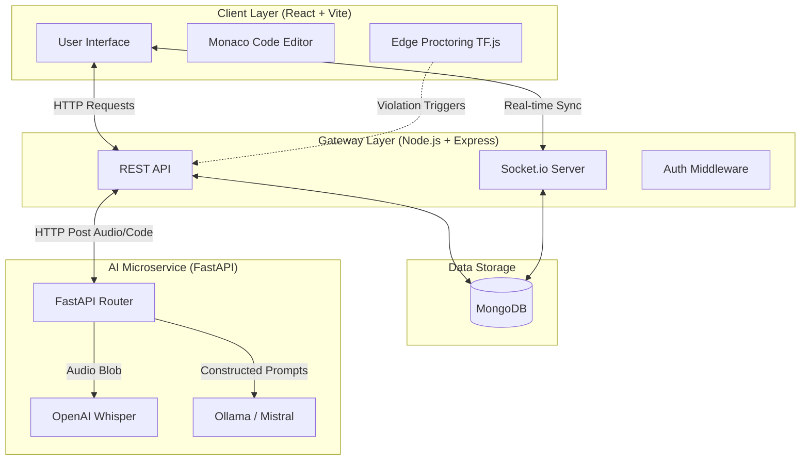

  <h1>🚀 AI-PROCTOR: Industry-Grade Technical Assessment Platform</h1>
  
## 1. Executive Summary

The modern technical hiring landscape is highly fragmented and notoriously inefficient. Organizations spend exorbitant amounts of capital and engineering hours conducting preliminary technical screens, while candidates frequently face inconsistent, biased, and high-stress evaluation environments. Traditional technical assessment platforms offer static coding challenges that fail to capture a candidate's communication skills, architectural thinking, or conceptual depth. Furthermore, ensuring assessment integrity (proctoring) usually requires costly third-party human-in-the-loop services.

**AI-PROCTOR** is engineered to resolve these systemic inefficiencies. It is a production-ready, end-to-end AI-driven interviewing ecosystem designed to replicate the intensity, adaptability, and rigor of a FAANG-level technical round. By consolidating generative AI (Ollama/Mistral), high-fidelity speech-to-text (OpenAI Whisper), real-time edge computer vision (TensorFlow.js COCO-SSD), and a robust polyglot backend architecture, AI-PROCTOR delivers a fully autonomous technical interview experience.

This document serves as a comprehensive Research Report and Software Requirements Specification (SRS) detailing the platform's architecture, Unique Selling Propositions (USPs), functional parameters, and technical implementation.

---

## 2. Introduction

### 2.1 Purpose of this Document
The purpose of this document is to outline the architectural design, system requirements, and functional capabilities of the AI-PROCTOR platform. It is intended for software engineers, engineering managers, talent acquisition leaders, and system architects who wish to understand the technical depth and business value of this autonomous assessment system.

### 2.2 Scope of the Platform
AI-PROCTOR focuses on automating the Level 1 and Level 2 technical screening processes for software engineering candidates. The scope includes:
- User authentication and profile management.
- Dynamic generation of tailored technical questions (both oral conceptual questions and coding challenges) based on user-selected roles and seniority levels.
- Real-time transcription of verbal answers using offline ML models.
- Real-time code execution environment using the Monaco Editor.
- Continuous, edge-based video proctoring to ensure academic integrity.
- Granular, AI-driven evaluation of responses yielding Technical, Confidence, and Integrity scores.

### 2.3 Definitions, Acronyms, and Abbreviations
- **SRS:** Software Requirements Specification.
- **USP:** Unique Selling Proposition.
- **Ollama:** A local runtime for operating Large Language Models (LLMs).
- **LLM:** Large Language Model.
- **MERN:** MongoDB, Express.js, React.js, Node.js.
- **FAANG:** Facebook, Amazon, Apple, Netflix, Google (representing top-tier tech companies).
- **COCO-SSD:** Common Objects in Context - Single Shot MultiBox Detector (An object detection model).
- **JWT:** JSON Web Token.

---

## 3. Unique Selling Propositions (USPs)

The AI-PROCTOR platform distinguishes itself from existing solutions through five core USPs, heavily rooted in cutting-edge machine learning and modern distributed systems engineering.

### 3.1 USP 1: Localized AI Engine for Zero-Cost, High-Privacy Evaluation
Unlike platforms that rely heavily on expensive, cloud-based LLM APIs (like OpenAI's GPT-4 or Anthropic's Claude), AI-PROCTOR leverages **Ollama** running locally (or within a secure, private VPC) utilizing the **Mistral** model. 
- **Cost Efficiency:** Processing thousands of interviews incurs zero API costs.
- **Data Privacy:** Candidate data, proprietary code, and interview transcripts never leave the organization's infrastructure. This provides a massive compliance advantage for enterprise adoption (GDPR, CCPA).
- **Zero Latency Spikes:** By circumventing public API rate limits and network congestion, the generation and evaluation times remain predictable.

### 3.2 USP 2: Real-Time Edge-Based Proctoring via WebGL/TensorFlow.js
Traditional proctoring sends continuous video streams to a central server for analysis, consuming massive bandwidth and raising extreme privacy concerns. AI-PROCTOR flips this paradigm by utilizing **TensorFlow.js (COCO-SSD)** directly in the candidate's browser.
- **Edge Computing:** The candidate's GPU/CPU runs the object detection model via WebGL. 
- **Bandwidth Optimization:** No video feeds are uploaded. The system only sends lightweight websocket boolean flags (`isPhoneDetected: true`, `isFaceMissing: true`) to the backend.
- **Instant Response:** Violation detection occurs in milliseconds, allowing the UI to instantly warn the candidate without server round-trip latency.

### 3.3 USP 3: Multi-Modal Adaptive Evaluation (Voice + Code)
Technical competence is not just about writing syntax; it is about articulating logic. AI-PROCTOR integrates **OpenAI Whisper** (hosted via a FastAPI microservice) to transcribe the candidate's verbal explanations. 
- The AI evaluation engine analyzes *both* the raw source code and the semantic transcription of the candidate's thought process. 
- This simulates a pair-programming interview where communication skills are weighted equally with technical accuracy.

### 3.4 USP 4: Socket-Driven "Iron-Clad" Session Management
Network volatility during an interview can induce candidate panic and corrupt assessment data. AI-PROCTOR utilizes a robust **Socket.io** event-driven architecture paired with a server-synced persistence layer.
- **State Reconciliation:** If a candidate's browser crashes or they lose connection, they can rejoin the session. The Node.js backend maintains the exact timer state, current question, and code draft, pushing the reconciled state back to the client upon reconnection.
- **Anti-Cheat Timer:** The timer is calculated server-side. Candidates cannot manipulate local JavaScript clocks to gain extra time.

### 3.5 USP 5: Comprehensive Analytics & Selection Probability Index
Instead of a binary pass/fail, AI-PROCTOR acts as a data intelligence tool. Post-interview, it generates an intricate dashboard featuring:
- **Technical Index:** A quantified score of code logic, time complexity, and syntax correctness.
- **Confidence/Communication Index:** Analyzed through the clarity of the transcribed speech and the lack of hesitations.
- **Integrity Score:** Deductions automatically applied based on the frequency and severity of proctoring violations (e.g., looking away, mobile phones, tab-switching).
- **Selection Probability:** A weighted heuristic aggregating the above metrics into a final percentage, predicting the candidate's exact fit for the role.

---

## 4. Overall System Architecture

### 4.1 Product Perspective
AI-PROCTOR operates as a decentralized, polyglot system comprising three distinct operational layers: The Client Layer (Frontend), The Gateway/Business Logic Layer (Node.js Backend), and the Intelligence Layer (Python/FastAPI Microservice). 

### 4.2 Polyglot Microservices architecture
The architectural decision to split the backend into two distinct microservices ensures optimal performance and language-specific strengths.
- **Node.js/Express (Port 5000):** Excels at high-concurrency I/O operations, WebSocket connections, database reading/writing, and serving as the primary REST API.
- **Python/FastAPI (Port 8000):** Excels at CPU-bound machine learning tasks. It handles audio processing (Pydub), model inference (Whisper), and LLM orchestration (Ollama).

### 4.3 System Architecture Diagram



### 4.4 Data Flow Lifecycle
1. **Initiation:** The Client requests an interview session via REST to the Node.js API.
2. **Setup:** Node.js creates a MongoDB session document and signals the Python service to generate the first adaptive question based on role parameters.
3. **Delivery:** The question is delivered via Socket.io to the React client.
4. **Execution:** The candidate writes code in the Monaco Editor and speaks. TF.js simultaneously monitors for cheating, sending lightweight alerts to Node.js.
5. **Submission:** Upon submission, an audio blob (WAV/MP3) and the raw code string are sent to Node.js.
6. **Processing:** Node.js forwards the audio and code to the Python FastAPI service.
7. **Intelligence Pipeline:** 
   - Python uses Whisper to transcribe audio.
   - Python constructs a massive prompt containing the question, code, and transcription.
   - Ollama evaluates the package and returns a structured JSON payload (Scores, Feedback, Ideal Answer).
8. **Finalization:** Python returns the JSON to Node.js, which updates MongoDB, calculates running averages, and pushes the results to the client via WebSockets. 

---

## 5. Detailed System Features & Functional Requirements

### 5.1 Authentication & User Management
- **FR-1.1:** The system shall allow users to register and authenticate using Google OAuth 2.0 or local email/password credentials.
- **FR-1.2:** Passwords must be securely hashed using `bcryptjs` before storage.
- **FR-1.3:** The system shall issue secure HTTP-only (or localized) JSON Web Tokens (JWT) for subsequent API authorization.
- **FR-1.4:** Users shall have a dedicated profile dashboard displaying their historical interview data, aggregate scores, and improvement trajectories.

### 5.2 Interview Configuration & Session Initiation
- **FR-2.1:** Users shall be able to configure an interview by specifying `Role` (e.g., MERN Stack, DevOps, Backend), `Level` (Junior, Mid, Senior), and `Duration` (e.g., 30, 45, 60 minutes).
- **FR-2.2:** Users shall select an `Interview Type` (Conceptual Oral only, or a Coding-Mix).
- **FR-2.3:** Upon initialization, the system must establish an isolated WebSocket room specific to the user's ID to prevent data leakage between concurrent sessions.

### 5.3 Adaptive Question Generation
- **FR-3.1:** The AI Microservice shall generate the first question based solely on the configured role and level.
- **FR-3.2:** Subsequent questions must be generated adaptively. The LLM must receive the candidate's previous answer, the AI's previous evaluation, and determine if the next question should be harder (if the candidate did well) or easier/fundamental (if the candidate struggled).
- **FR-3.3:** The system must strictly separate coding questions (requiring implementation) from oral questions (requiring conceptual explanation) as per the chosen interview type ratio (e.g., 20% coding, 80% oral).

### 5.4 The "Monaco" Coding Sandbox
- **FR-4.1:** The frontend shall implement the `@monaco-editor/react` library, providing a VS Code-like coding experience.
- **FR-4.2:** The sandbox must support syntax highlighting, basic autocomplete, and multi-line editing.
- **FR-4.3:** The editor's state must be preserved locally during the session to prevent code loss upon accidental refreshes.

### 5.5 Advanced Proctoring & Integrity Verification
- **FR-5.1:** The platform shall request and maintain access to the user's webcam throughout the active session.
- **FR-5.2:** TensorFlow.js and the `coco-ssd` model shall evaluate the video stream at a minimum of 5 frames per second locally.
- **FR-5.3:** If `class: 'cell phone'` is detected with a confidence > 60%, a severe violation event must be logged.
- **FR-5.4:** If `class: 'person'` count drops to 0 (candidate leaves frame) or exceeds 1 (multiple people), a violation event must be logged.
- **FR-5.5:** The React application shall attach event listeners to `document.visibilityState`. Any tab switching or window minimization shall increment the violation counter.
- **FR-5.6:** Violations directly apply mathematical penalties to the final technical and confidence scores.

### 5.6 Evaluation Engine & Scoring Metrics
- **FR-6.1:** For oral questions, the LLM must grade the transcription text out of 100, focusing on keyword accuracy, conceptual clarity, and logical flow.
- **FR-6.2:** For coding questions, the LLM must evaluate the code for syntax correctness, algorithmic efficiency (Big O), and structural logic.
- **FR-6.3:** If audio input is detected as gibberish, silence, or irrelevant background noise, the system must explicitly assign a score of 0.
- **FR-6.4:** The AI must generate an "Ideal Answer" utilizing Markdown formatting for candidate post-interview review.

---

## 6. Non-Functional Requirements (NFRs)

### 6.1 Performance & Scalability
- **Local LLM Throughput:** The inference time for the Mistral model (via Ollama) must be optimized through quantization (e.g., 4-bit) to ensure question generation and evaluation occur within 3-8 seconds on standard consumer hardware.
- **Microservice Decoupling:** The Node.js application must remain unblocked during AI evaluation. All AI requests must be handled asynchronously via Promises, allowing Node.js to manage hundreds of concurrent WebSocket connections.

### 6.2 Security & Data Privacy
- **Stateless Authentication:** JWTs ensure that Node.js does not need to query the database for session validation on every request, reducing latency while maintaining security.
- **No Cloud Video Storage:** Because proctoring is edge-based (TF.js), video frames are destroyed immediately after processing. No video data traverses the network, ensuring absolute compliance with global privacy standards.
- **CORS Protection:** Cross-Origin Resource Sharing is strictly limited to allowed frontend origins to prevent CSRF attacks.

### 6.3 Reliability & Availability
- **Graceful Error Handling:** If the Python AI service crashes or times out, the Node.js backend must catch the exception, pause the interview timer, alert the candidate via WebSockets, and allow a retry mechanism without terminating the entire session.
- **Database Consistency:** MongoDB transactions and schema validation ensure that session objects maintain referential integrity.

### 6.4 Usability & Design Philosophy
- **Command Center Aesthetic:** The UI utilizes modern CSS paradigms—glassmorphism, deep dark mode gradients, and fluid Framer Motion animations. This minimizes candidate anxiety by providing a clean, premium, and distraction-free environment.
- **Real-Time Feedback:** Toast notifications (`react-toastify`) are used aggressively to keep the user informed about system states ("AI is thinking", "Transcribing audio", "Warning: Tab Switch Detected").

---

## 7. Technology Stack Deep-Dive

### 7.1 Frontend (Client-Side)
- **Framework:** React 18 (Vite Bundler). Chosen for its lightning-fast HMR and optimized production builds.
- **State Management:** Redux Toolkit. Handles global state for user sessions, authentication, and interview progress.
- **Routing:** React Router DOM (v7). Enables seamless SPA navigation.
- **Real-Time Communication:** `socket.io-client`. Listens for granular updates from the backend without requiring manual polling.
- **Machine Learning (Edge):** `@tensorflow/tfjs` and `@tensorflow-models/coco-ssd` for running 80-class object detection directly in the browser using WebGL acceleration.
- **Code Editor:** `@monaco-editor/react`. Brings the power of VS Code directly into the browser.
- **Charting:** `Chart.js` & `react-chartjs-2` for rendering the visually striking post-interview radar and bar charts for the Selection Probability metrics.

### 7.2 Backend (API Gateway & Data Access Layer)
- **Runtime:** Node.js (v18+).
- **Web Framework:** Express 5.
- **Database:** MongoDB (using Mongoose ODM). Stores Users, Sessions, Questions, and granular evaluation metrics.
- **WebSockets:** `socket.io`. Orchestrates the intricate dance of timing, signaling, and asynchronous AI updates.
- **Security:** `bcryptjs` for password hashing, `jsonwebtoken` for auth, and Google Auth Library for seamless social logins.

### 7.3 AI Microservice (Evaluation Layer)
- **Runtime:** Python 3.10+.
- **Web Framework:** FastAPI. Chosen for its extreme speed, automatic OpenAPI documentation, and native async support.
- **LLM Orchestration:** `ollama` Python bindings. Communicates with the local Mistral process.
- **Audio Processing:** `whisper` for state-of-the-art automatic speech recognition (ASR), and `pydub` for robust audio format conversion (cleaning up web-audio blobs into standard formats for Whisper).

---

## 8. Installation & Deployment Guide

Deploying AI-PROCTOR requires setting up both microservices and the frontend client. This system is designed to run locally for zero-cost execution.

### 8.1 System Prerequisites
1. **Node.js** (v18 or higher)
2. **Python** (v3.10 or higher)
3. **MongoDB** (Local instance or MongoDB Atlas cluster)
4. **Ollama** (Must be installed on the host machine. Download from ollama.com)
5. **FFmpeg** (Required by Pydub/Whisper for audio processing. Must be installed and added to the system PATH).

### 8.2 Service Installation & Initialization

#### Step 1: Install and Run Ollama
Open a terminal and pull the required LLM.
```bash
ollama pull mistral
ollama serve
```

#### Step 2: Configure and Start the AI Microservice (Python)
Navigate to the AI service directory, create a virtual environment, install dependencies, and start the FastAPI server.
```bash
cd ai-service
python -m venv venv
# Windows:
venv\Scripts\activate
# Mac/Linux:
source venv/bin/activate

pip install -r requirements.txt
python main.py
```
*The AI service will now be running on `http://localhost:8000`.*

#### Step 3: Configure and Start the Node.js Backend
Navigate to the backend directory, install packages, set up your `.env` variables, and start the Express server.
```bash
cd backend
npm install
```
**Create a `.env` file in the `backend` directory:**
```env
PORT=5000
MONGO_URI=your_mongodb_connection_string
JWT_SECRET=your_super_secret_key
NODE_ENV=development
```
```bash
npm run dev
```
*The Backend service will now be running on `http://localhost:5000`.*

#### Step 4: Configure and Start the Frontend (React)
Navigate to the frontend directory, install packages, configure environment variables, and start the Vite development server.
```bash
cd frontend
npm install
```
**Create a `.env` file in the `frontend` directory:**
```env
VITE_BACKEND_URL=http://localhost:5000
VITE_GOOGLE_CLIENT_ID=your_google_oauth_client_id
```
```bash
npm run dev
```
*The Frontend application will be accessible at `http://localhost:5173`.*

---

## 9. Future Roadmap & Enhancements

While AI-PROCTOR currently represents a state-of-the-art implementation, the following architectural enhancements are planned for future iterations:

1. **Docker Orchestration:** Creation of a comprehensive `docker-compose.yml` to containerize MongoDB, the Node.js server, and the Python FastAPI service, allowing for one-click deployments.
2. **Kubernetes Scalability:** For enterprise usage, deploying the AI service onto GPU-optimized Kubernetes clusters (e.g., using NVIDIA Triton Inference Server) to handle thousands of concurrent Whisper and Ollama requests.
3. **Multi-Language Execution Environment:** Upgrading the Monaco sandbox to send code to secure Docker sandboxes (e.g., Judge0 API) for actual compilation and test-case execution, rather than relying solely on LLM static analysis.
4. **Advanced Behavioral Analysis:** Integrating facial sentiment analysis (via WebGL) to gauge candidate stress levels, calculating an emotional quotient (EQ) alongside technical aptitude.

---

## 10. Conclusion

AI-PROCTOR fundamentally redefines the technical interview paradigm. By decentralizing the evaluation process—pushing proctoring to the client's edge and utilizing cost-free, highly capable local LLMs for intelligence—it creates a system that is infinitely scalable, deeply analytical, and respectful of candidate privacy. 

This platform bridges the gap between the logistical nightmare of manual technical screening and the rigid, uninspiring nature of traditional algorithmic testing platforms. AI-PROCTOR does not just test code; it evaluates the engineer.

---
